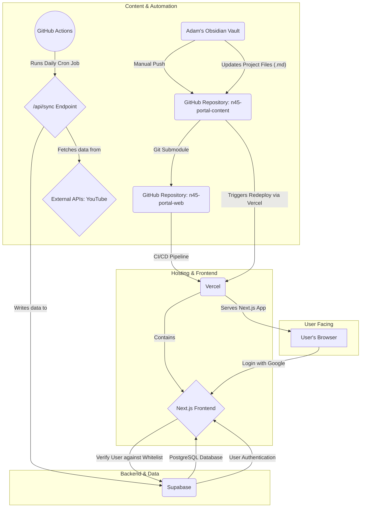

# N45.dev Portal - System Architecture

---

This document provides a detailed technical blueprint of the n45.dev portal, outlining the technology stack, data flow, and core components.

## 1. High-Level Architecture Diagram

## 2. Technology Stack

The project is built on a modern, serverless architecture designed for scalability, low maintenance, and rapid development.

| Component             | Technology                               | Justification                                                                                             |
| --------------------- | ---------------------------------------- | --------------------------------------------------------------------------------------------------------- |
| **Frontend Framework**  | [Next.js](https://nextjs.org/) (React)   | Provides a robust framework for server-side rendering (SSR) and static site generation (SSG).               |
| **Styling**             | [Tailwind CSS](https://tailwindcss.com/) | A utility-first CSS framework that enables rapid UI development directly in the markup.                   |
| **Hosting Platform**    | [Vercel](https://vercel.com/)            | Offers seamless, Git-based deployment, CI/CD, and serverless function hosting, optimized for Next.js.       |
| **Database & Auth**     | [Supabase](https://supabase.com/)        | Provides a PostgreSQL database, Google OAuth 2.0 authentication, and a secure data API out of the box.    |
| **Content Source**      | [GitHub](https://github.com/) (Git Submodule) | The `n45-portal-content` repository is used as a "headless CMS" to store project and profile markdown files. |
| **Automation**          | [GitHub Actions](https://github.com/features/actions) | Used for running scheduled tasks (cron jobs) to sync data from external APIs.                        |
| **Email Forwarding**    | [ImprovMX](https://improvmx.com/)        | Manages email forwarding for the `n45.dev` domain.                                                        |

## 3. Component Breakdown

### Frontend (Vercel)

-   The entire application is a Next.js project.
-   **Static Pages:** Pages like the main showcase (`/`) are statically generated at build time for maximum performance. Vercel automatically caches these pages at the edge.
-   **Server-Side Rendered (SSR) Pages:** The protected `/secure` area is rendered on the server for each request to ensure the user's authentication status is checked.
-   **API Routes:** The `/api/sync` endpoint is a serverless function hosted by Vercel, used to trigger the data aggregation process.

### Backend & Database (Supabase)

-   **`posts` Table:** The primary table storing all aggregated data for the social feed. The `metadata` column (JSONB) provides flexibility for storing varied data structures from different sources.
-   **`approved_users` Table:** This table acts as a whitelist for the secure area. It contains the email addresses of users authorized to access protected content.
-   **Authentication:** Supabase handles the entire Google OAuth 2.0 flow. When a user logs in, the application checks their email against the `approved_users` table to grant access.

### Content Source (Git Submodule)

-   The content for the project showcase and profile page is managed in a separate private GitHub repository: `n45-portal-content`.
-   This repository is linked to the main `n45-portal-web` repository as a Git submodule.
-   This separation of content and code allows for content updates without triggering a full code rebuild. Pushing a change to the content repository is sufficient to trigger a new deployment on Vercel.

### Automation (GitHub Actions)

-   A cron job is defined in a workflow file (`.github/workflows/sync.yml`).
-   This job runs on a daily schedule.
-   It sends a `POST` request to the protected `/api/sync` endpoint on the live Vercel application.
-   A secret token is used to authenticate the request, ensuring that only GitHub Actions can trigger the sync process. This prevents unauthorized users from initiating a data refresh.